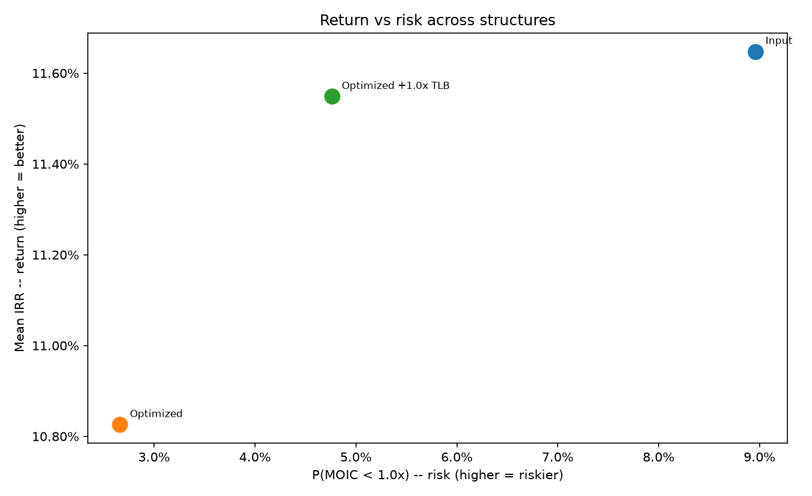
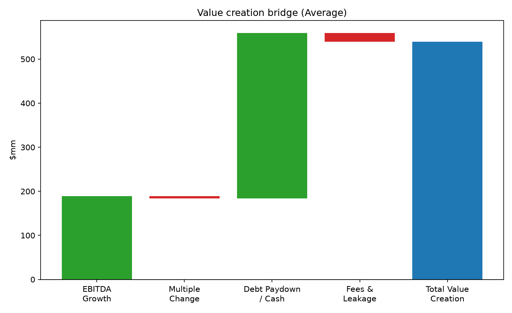

# corefin

A vectorized core library for quantitative finance / investment banking
projects, built as the shared foundation for:

1. **Financing Structure Optimizer** (built — see [below](#financing-structure-optimizer))
   — picks the debt/equity mix that maximizes sponsor returns subject to
   leverage/coverage/covenant constraints, by calling this core model many
   times over a grid of candidate structures.
2. **Sponsor LBO Monte Carlo Engine** — runs thousands of operating
   scenarios to produce distributions of IRR, MOIC and covenant breaches.
3. **Credit-Loss Forecasting Engine** (later, bank-specific).
4. **Bank M&A CET1 & Accretion Simulator** (later, bank-specific).

Projects 3 and 4 need a bank statement model, which is structurally
different from a corporate model. It isn't built here, but the shared
`timeline`, `assumptions`/`scenarios`, and `checks` layers are designed so
it can be added as a sibling module — see [Where the bank model plugs
in](#where-the-bank-model-plugs-in) below.

## Install & run

```bash
uv sync
uv run pytest                       # fast tests (excludes the slow marker)
uv run pytest -m slow               # performance tests (10k scenarios; 15x15 grid search)
uv run ruff check . && uv run ruff format --check .
uv run corefin run --config configs/example_midmarket.yaml
uv run corefin optimize --config configs/example_midmarket.yaml
uv run corefin simulate --config configs/example_midmarket.yaml
```

The `run` command prints a summary (sources & uses, IRR/MOIC distribution
across scenarios, covenant breach probabilities) and exports one scenario's
full statements, debt schedule and credit metrics to `output.xlsx`
(`--output` to change the path, `--scenario` to pick which one).

The `optimize` command (config must have an `optimizer:` section) searches
for the debt structure that maximizes sponsor returns subject to the
configured constraints, and prints the recommendation alongside a
side-by-side comparison against the input config's own structure — see
[Financing Structure Optimizer](#financing-structure-optimizer) below.

The `simulate` command (config must also have an `optimizer:` section)
stress-tests a structure — by default the input config's own structure,
the optimizer's recommendation, and a +1.0x-more-levered variant — with
richer Monte Carlo scenario generation, named deterministic stress
scenarios, downside/distress analytics, returns attribution and driver
importance, answering the questions an investment committee actually
asks about a deal — see
[Sponsor LBO Monte Carlo Engine](#sponsor-lbo-monte-carlo-engine) below.

## Architecture

```
src/corefin/
  timeline.py             Period grid: n_periods, period lengths, projection flags
  assumptions/            Pydantic config schema + YAML loader
  scenarios/               DriverSet (vectorized inputs) + deterministic/stochastic generators
  statements/              Income statement, balance sheet, cash flow, orchestration
  debt/                    Tranche config, amortization/fee sizing, waterfall, circularity solver
  metrics/                 Credit metrics, covenant evaluation
  transaction/              Sources & uses, exit valuation, IRR/MOIC
  checks/                   Reusable integrity-check framework + concrete checks
  io/                       Excel export
  optimize/                 Financing Structure Optimizer (structure, pricing, evaluate,
                             search, excel_export, heatmap) -- see below
  cli.py                    `corefin run` / `corefin optimize` / `corefin version`
```

**Every time-series quantity is a numpy array of shape `(n_scenarios,
n_periods)`.** A single deterministic case is `n_scenarios = 1`. There are
no Python loops over scenarios anywhere; the only loop is over periods
inside the debt module, because the debt schedule and its interest
circularity are genuinely path-dependent (each period's ending balance
depends on the prior period's).

### Data flow

```
YAML config --pydantic--> RootConfig
RootConfig + Timeline --> DriverSet (scenarios/generator.py)
DriverSet --> revenue/EBITDA/D&A/capex/NWC (statements/corporate_model.py)
  --> debt/circularity.run_debt_schedule (loops periods; vectorized fixed-point per period)
  --> income statement, balance sheet, cash flow statement
  --> metrics/credit_metrics, metrics/covenants
  --> transaction/sources_uses (entry), transaction/returns (exit, IRR/MOIC)
```

`run_corporate_model_no_debt` exists mainly as a way to validate the
statement plumbing (revenue → EBITDA → NOL/tax → NI → BS → CFS) in
isolation, without the debt module's complexity. `run_corporate_model_with_debt`
is the real entry point for any project with leverage.

## Sign & unit conventions

Documented once, in `assumptions/schema.py`, and repeated here:

- All dollar amounts are **$mm**.
- All rates, margins, growth figures and percentages are **decimal
  fractions** (`0.20`, not `20` or `"20%"`).
- All multiples (entry/exit, leverage) are **bare floats** (`5.5x` → `5.5`).
- Cash inflows to the company are positive; interest expense, fees, and
  coverage-metric denominators are positive costs.
- In the cash flow statement, `debt_draws` is a positive inflow,
  `debt_repayments` is already negative-signed (an outflow), and
  `dividends` is a positive outflow (sign-flipped internally).

## The debt module and interest circularity

Interest on the **average balance** for period *t* depends on period *t*'s
ending balance, which depends on cash available for debt service, which
depends on net income, which depends on interest for period *t*. This is
circular, but only **within** a period — the prior period's ending balance
is already fixed by the time period *t* starts. `debt/circularity.py`
solves this with a vectorized fixed-point iteration per period (guess
interest → run the waterfall → recompute interest from the resulting
balances → repeat until the change is below `circularity_tolerance`, or
raise `CircularityNotConvergedError` after `circularity_max_iterations`).
Set `waterfall.interest_mode: beginning_balance` to skip the circularity
entirely (non-circular, useful for speed or debugging) — it converges in
exactly two passes since there's nothing to iterate on.

The waterfall itself (`debt/waterfall.py`) runs, per period, in this order:
minimum cash balance → mandatory amortization (capped at the outstanding
balance) → revolver draw if there's a shortfall (capped at the undrawn
commitment; a shortfall that still can't be covered is *flagged*, not
silently allowed) → revolver paydown → optional cash sweep by priority
(`sweep_priority`, lower = swept first) at a configurable `sweep_pct`.

## Covenants

`CovenantConfig` (`assumptions/schema.py`) supports four metrics:
`total_net_leverage` / `senior_net_leverage` (**maximum** — breach when the
metric exceeds `threshold`) and `interest_coverage` / `fccr` (**minimum** —
breach when the metric falls below `threshold`). `metrics/covenants.py`
signs `headroom` the same way for both directions, so positive headroom
always means compliant regardless of which kind of covenant it is.

**Springing covenants.** Sponsor-backed term loans are usually
covenant-lite: the maintenance test applies only to the revolver, and only
once it's meaningfully drawn. Set `springing_revolver_draw_pct` (e.g.
`0.35`) on a covenant and it's only *tested* in a period where the
revolver's drawn balance / commitment strictly exceeds that fraction —
untested periods are neither a pass nor a breach. `CovenantResult.tested`
(a `(n_scenarios, n_periods)` bool array, same shape as `breach`) lets a
caller distinguish tested-and-breached, tested-and-passed, and not-tested.
Leaving the field unset (the default) tests the covenant every period from
`test_from_period` onward, exactly as before this field existed.

**Headroom warnings.** `metrics.covenants.compute_base_case_headroom`
takes a single (typically deterministic, zero-vol) scenario's
`CovenantResult`s and reports the cushion — `headroom / threshold` — at
each covenant's *first tested* period; a springing covenant that never
triggers in that scenario reports `tested=False` rather than a fabricated
number. `low_headroom_warnings` filters that down to covenants under a
minimum cushion (default 15%). The CLI surfaces both: `corefin run` prints
base-case headroom per covenant and a `WARNING:` line for anything under
`--min-headroom-pct`. This is a display/warning threshold for the tool's
output, not a modeling assumption, so it's a CLI flag rather than a YAML
field.

## Adding a new tranche type

1. Add the new value to `TrancheType` in `assumptions/schema.py`.
2. If it needs new fields (e.g. a step-up coupon), add them to
   `TrancheConfig` with a `model_validator` enforcing any cross-field
   rules (see the existing fixed/floating-rate and PIK/revolver checks for
   the pattern).
3. If it needs special seniority treatment for leverage metrics, add it to
   (or leave it out of) `SENIOR_TRANCHE_TYPES` in `metrics/credit_metrics.py`.
4. The waterfall (`debt/waterfall.py`), schedule sizing (`debt/schedule.py`)
   and circularity solver (`debt/circularity.py`) are all written generically
   against `TrancheConfig` fields (`is_revolver`, `pik_fraction`,
   `cash_sweep_eligible`, `sweep_priority`, ...) — no changes needed there
   unless the new type needs genuinely new waterfall *behavior* (e.g. a
   payment-in-kind toggle that can flip mid-life), in which case add a field
   and branch on it in `circularity._recompute_interest` / `waterfall.run_period_waterfall`.

## A known simplification worth knowing about

`OpeningBalanceSheet` cannot see the tranche list (it's validated
independently by pydantic), so it can't enforce "assets = liabilities +
equity" on its own — that check depends on whether you're about to run
`run_corporate_model_no_debt` (which always treats debt as zero) or
`run_corporate_model_with_debt` (where each tranche is already funded at
face value as of period 0's start, so `equity_mm` must be sized to cover
that too). This is exactly what a real deal's Sources & Uses does
automatically, and it's exactly what `optimize/structure.py` now does for
every candidate structure the optimizer builds (see below) — but a
hand-written config (like the base of `configs/example_midmarket.yaml`,
used by `corefin run`) still has to get this right by hand. Treat
`OpeningBalanceSheet` as "whatever numbers are consistent with the model
you're about to run" and let `checks.check_balance_sheet_balances` tell
you at runtime if they aren't. `configs/example_midmarket.yaml` shows a
debt-inclusive example that balances (verify the identity: `cash + nwc +
ppe + goodwill + deferred_financing_costs == other_liabilities + equity +
sum(non-revolver tranche sizes)`).

## Financing Structure Optimizer

Given a company, an entry price and market conditions, `optimize/` searches
over debt tranche sizes for the structure that maximizes sponsor returns
subject to financing constraints, using the same Monte Carlo scenario
engine to measure risk. `corefin optimize --config <file>` answers: what's
the best structure, what limits it, and how fragile is it?

### Decision variables and structure building

`optimizer.decision_variables` (in `assumptions/schema.py`) names which
tranches are free to vary, each as a multiple of entry EBITDA with
min/max bounds and an optional grid step (if omitted, the step is derived
from `search.grid_points_per_dimension` rather than a hardcoded default).
Any tranche can be a decision variable, including the revolver or an
optional subordinated/PIK tranche with `min_multiple: 0.0` to let the
search switch it off entirely — it isn't special-cased.

For each candidate, `optimize/structure.build_structure` (extended with
pricing by `optimize/pricing.build_priced_structure`) resizes the decision
tranches, recomputes sources & uses (debt sizes, financing fees/OID that
scale with tranche size, transaction fees, sponsor equity plug), and
rebuilds the opening balance sheet: `cash_mm` is pinned to
`waterfall.minimum_cash_mm`, `deferred_financing_costs_mm` and `equity_mm`
come straight from sources & uses, and `goodwill_mm` is the plug that
balances the sheet. `nwc_mm`/`ppe_mm`/`other_liabilities_mm` are held
fixed — company facts independent of financing structure — read from the
config's own `opening_balance_sheet`. A dedicated test
(`test_optimize_structure.py`) proves the builder reproduces
`configs/example_midmarket.yaml`'s hand-entered opening balance sheet
exactly, goodwill included.

### Secured vs unsecured debt

Every tranche resolves an `is_secured` property (`TrancheConfig.secured` in
`assumptions/schema.py`): `None` (the default) falls back to a type-based
default — revolver, term loan A and term loan B are secured; senior
notes, subordinated and PIK tranches are not, matching how these are
typically structured in a real LBO — and an explicit `secured: true/false`
in config overrides that default for a specific tranche (e.g. an
unsecured TLB or secured notes tranche). "Secured leverage" (the tranches
where `is_secured` is true, excluding the revolver, which is excluded
from closing leverage entirely — undrawn at close by convention) replaced
what used to be called "senior leverage" everywhere: `ClosingLeverage.secured_leverage`,
the `max_secured_leverage` constraint, `CreditMetrics.secured_net_leverage`,
and the pricing grid's `secured_leverage` basis option. **A config using
the old `max_senior_leverage` key or `basis: senior_leverage` is rejected
with a clear pydantic error** (`DeterministicConstraintsConfig` and the
pricing tranche model both set `extra="forbid"`) rather than silently
ignored — there's no ambiguity-tolerant deprecation path for a field
rename that changes which tranches are counted.

`optimize/pricing.pricing_sanity_warnings` is a sanity check, not a hard
constraint: it compares each unsecured tranche's all-in coupon (at the
deterministic base-case base rate at close) against every secured
tranche's, and warns — naming both tranches and their rates — if the
unsecured one isn't priced above the secured one, since unsecured debt
should command a premium for ranking behind secured debt in a default.
It also warns if an unsecured tranche is cash-sweep eligible, since
real high-yield notes are typically call-protected instead of being
prepaid from excess cash. Both `corefin run` (against the config's
tranches as given) and `corefin optimize` (against the final
recommended/confirmed candidate's priced tranches) print these once per
run — never per grid-search candidate, which would be both spammy and
misleading, since the check is about the final structure being
reported, not every candidate scanned along the way.

### Leverage-dependent pricing and market capacity

`optimizer.pricing` is a linear ramp, per tranche: above a leverage
threshold (`total_leverage` or `secured_leverage` — gross of cash,
computed once at close, distinct from the period-by-period *net*
leverage the covenant system tracks), spread/fixed rate and fees step up
by a fixed amount per turn. In `configs/example_midmarket.yaml`, the TLB
(secured) is priced off secured leverage and the notes (unsecured) off
total leverage, matching how the two are actually priced in a real deal.
A tranche not listed in `pricing.tranches` is never repriced.
`market_capacity_mm` (per tranche) and `pricing.total_market_capacity_mm`
are hard limits — debt simply isn't available above them, so those
candidates are marked infeasible before the (expensive) model even runs.
**The pricing grid and capacity limits in `configs/example_midmarket.yaml`
are illustrative placeholders for demonstrating the feature, not real
market data.**

### Constraints and objective

Each constraint is optional (unset = unconstrained). Deterministic, at
close: `max_total_leverage`, `max_secured_leverage`,
`min_equity_pct_of_sources`, `min_interest_coverage_at_close` (the last
evaluated on a deterministic, zero-vol run — same convention as covenant
headroom). Stochastic, across the Monte Carlo scenarios:
`max_covenant_breach_probability` (one aggregate probability across every
configured covenant — P(the scenario breaches any tested period of any
covenant) — not a separate limit per covenant),
`max_revolver_shortfall_probability`, `max_loss_of_capital_probability`
(P(MOIC < 1.0x)). A candidate with negative sponsor equity (debt sources
exceeding total uses) is always infeasible, regardless of configured
constraints — not a fundable structure. Every other constraint still runs
the model and records the actual value even when violated, so the grid
export shows near-misses, not just pass/fail.

Stochastic constraints are checked on the search sample
(`n_scenarios_search`, default 2,000) during the grid search, but the
final confirmation run uses a larger sample (`n_scenarios_confirm`,
default 10,000) — a structure that looked feasible on the smaller sample
can fail a stochastic constraint the larger sample actually catches. The
CLI prints each stochastic constraint's search-sample and
confirmation-sample value side by side so a search/confirm gap is visible
even when it doesn't flip feasibility. When the confirmation run *does*
find a violation, `run_optimization` falls back automatically: it re-runs
`confirm` against the next-best feasible-on-search candidates (ranked by
objective, up to `search.max_confirmation_fallback_attempts`, default 5)
until one actually confirms, and reports the fallback in
`OptimizationResult.fallback` (attempts made, whether it succeeded, and
the original recommendation that failed) — surfaced as a CLI `NOTE:` line.
If every attempt fails, `NoConfirmedStructureError` is raised rather than
silently returning a structure nothing has actually confirmed.

### Binding-constraint diagnostics

`optimize/diagnostics.py` answers "what's actually stopping the optimizer
from adding more debt" at three levels, each more informative (and more
expensive) than the last:

1. **`binding_items`** — is the recommended structure's *own* value close
   to one of its configured limits, or close to a decision-variable
   bound? Tolerances are configurable per constraint type
   (`optimizer.tolerances`): probabilities use an absolute
   percentage-point tolerance (`probability_tolerance_pp`, default 2pp —
   a relative tolerance is too tight near small probabilities, e.g. a
   ~9.6% breach probability against a 10% limit is clearly binding but
   only ~4% away in relative terms), everything else (leverage, coverage,
   equity %) uses a relative tolerance (`relative_tolerance_pct`, default
   5%). A decision variable within one refinement step of its configured
   min/max is reported separately, labeled `[bound]` rather than
   `[constraint]` — "the grid was too narrow" and "an economic limit was
   hit" are different problems with different fixes.
2. **`limiting_constraints_from_neighbors`** — among the grid/refinement
   points immediately adjacent to the recommendation, which constraints
   made the *infeasible* ones fail, and how often? This is the direct
   answer to "what stops us adding more debt": not just what's
   numerically close to binding at the optimum, but what actually
   excluded the neighbors that would have had a better objective (this
   can surface hard-infeasibility reasons like `market_capacity` too,
   which have no single config field to relax — those show up here but
   are skipped by the relaxation table below).
3. **`relaxation_sensitivity`** — for each binding/limiting item, actually
   loosen it by a configured amount (`optimizer.relaxation`:
   `probability_relax_pp`, `leverage_relax_turns`, `equity_pct_relax_pp`,
   `coverage_relax_turns`) and re-run a full grid search on the *same*
   common random numbers, reporting the objective and leverage delta — a
   shadow-price table: which constraint, if loosened, would actually
   help, and by how much?

`compute_diagnostics` runs all three and is what the CLI and Excel export
both read from.

The objective (`optimizer.objective.kind`) is mean, median or a percentile
of IRR, or a mean-downside blend: `mean_irr - downside_lambda *
(mean_irr - percentile_irr)` (reduces to the mean at `downside_lambda=0`
and exactly to the percentile at `downside_lambda=1`). IRR is always
well-defined: `transaction/returns.py` floors the realized exit equity
value at zero (limited liability — a wipeout is a 0x MOIC / ~-100% IRR,
never negative) and pins the Newton-Raphson IRR solver directly to
-99.9999% for the degenerate case of zero distributions of any kind
(that scenario's NPV equation has no root to converge to at all, not
just a very negative one) — both were real bugs this project's own tests
caught while building the optimizer.

### Search method

The problem is low-dimensional (2-4 variables) and the objective is noisy
(Monte Carlo), so:

1. **Common random numbers.** `optimize/search.generate_search_drivers`
   builds one `DriverSet` up front (fixed seed), reused for every
   candidate evaluated — differences in the objective between structures
   reflect the structure, not fresh sampling noise. Financing structure
   never affects operating performance (revenue/EBITDA), so this is
   trivially exact, not an approximation.
2. **Coarse grid search** (`grid_search`) over the full cartesian product
   of decision-variable bounds, reporting evaluation count and runtime.
3. **Local refinement** (`refine`): a finer grid in a shrunk neighborhood
   (± one coarse step, clipped to the original bounds) around the best
   feasible grid point. Chosen over Nelder-Mead specifically to avoid a
   new dependency (`scipy`) for a 2-4 dimensional problem where a finer
   grid is just as effective, simpler to test against the coarse grid
   within tolerance, and robust to Monte Carlo noise given common random
   numbers already make nearby candidates' differences mostly real
   signal. Refinement can only match or improve the coarse optimum, never
   regress it.

`search.n_scenarios_search` (default 2,000) drives the search; the chosen
structure is then re-run at `search.n_scenarios_confirm` (default 10,000)
for a more robust final read (see the search/confirm fallback behavior
above). `run_optimization` orchestrates search → refine → confirm end to
end; the same seed always gives the same answer.

### Outputs

`corefin optimize` prints the recommended structure (tranche sizes in $mm
and x EBITDA, priced spread/fixed rate, equity check and %), the
objective and IRR/MOIC distribution, each stochastic constraint's
search-sample and confirmation-sample value side by side, a fallback
`NOTE:` line when the search-sample recommendation failed confirmation
and a different structure was substituted, the three-level binding-constraint
diagnostics (binding items, what's limiting adjacent candidates, and the
relaxation sensitivity table), and a side-by-side comparison against the
input config's own structure (evaluated with the same common random
numbers).

It exports three files:

- `optimization.xlsx` (`--output`): every evaluated candidate (`Grid
  Results`), the feasible subset sorted by return with the recommendation
  flagged (`Efficient Frontier`), the recommended structure's full
  statements/debt schedule/credit metrics (produced by the exact same
  sheet-writing code as `corefin run`'s export —
  `io/excel_export.write_scenario_sheets`, factored out for reuse), and
  two new sheets: `Binding & Limiting` (the binding items and the
  limiting-constraints-from-neighbors table) and `Relaxation Sensitivity`
  (the shadow-price table).
- `heatmap.png` (`--heatmap`): a matplotlib PNG of the objective surface
  over the first two decision variables (any other decision variable held
  at the recommended value — a 2D profile slice). The infeasible region is
  colored by *which* constraint made each cell infeasible (with a legend),
  not plain gray, so the shape of each constraint's boundary is visible
  directly on the grid; the recommendation is marked with a star.
- `leverage_frontier.png` (`--leverage-frontier`): the best objective
  achievable at each level of total closing leverage seen in the
  grid/refinement pool — a green line for leverage levels where a feasible
  candidate was found, a red dashed tail for levels where every attempt
  was infeasible (labeled along the curve with the constraint that blocked
  the most candidates there), and the recommendation marked with a star.
  Read left to right, this chart *is* the answer to "why not more debt":
  returns keep rising with leverage (cheaper, more debt-funded capital
  boosting equity returns, as long as the deal's return exceeds the cost
  of that debt) right up until the red tail — the point past which no
  candidate the search tried satisfied every constraint. That returns keep
  rising with leverage until something binds is normal, expected LBO
  behavior, not a sign the model is missing a limit; the result is driven
  by the configured constraints and decision-variable bounds, not by the
  pricing grid arbitrarily topping out.

## Sponsor LBO Monte Carlo Engine

`corefin simulate --config <file>` stress-tests a deal structure —
typically the Financing Structure Optimizer's recommendation — to answer
the questions an investment committee actually asks: what's the realistic
range of returns and how bad is the bad case, where do the returns come
from, which assumptions drive the risk, how does the deal hold up in
specific stress scenarios, and how much more fragile is a more levered
structure. Everything here lives in `corefin/simulate/` and is built on
the same core statement/debt/transaction modules as `run` and `optimize`
— no parallel model.

### Richer scenario generation

`scenarios/generator.py`'s existing `generate_stochastic_drivers` (i.i.d.
per-period normal shocks, Cholesky-correlated across drivers) is the
*simple* mode and is completely untouched: it's still exactly what `run`
and `optimize` use, and it's still what any `simulate` config gets unless
it explicitly opts in to `scenario.advanced`. When that block is present,
`generate_stochastic_drivers` dispatches to a richer generator instead,
adding (each independently switchable, all illustrative defaults):

- **Persistence**: AR(1) autocorrelation on the shock feeding
  `revenue_growth` and `ebitda_margin` (`scenario.advanced.persistence`),
  so a bad year has some probability of being followed by another bad
  year, instead of every period being independent noise.
- **Recession regimes**: a configurable annual probability of a new
  downturn starting (`scenario.advanced.regime`), each one running a
  fixed duration with a constant hit to growth and margin — bad years
  cluster the way they do in reality, instead of averaging out.
- **Fat tails**: Student-t innovations instead of normal
  (`scenario.advanced.fat_tails`, configurable degrees of freedom,
  variance-normalized so `driver_vol`'s configured stds keep their
  meaning) — applies to every stochastic driver's innovation, composing
  cleanly with persistence rather than being a separate mechanism.
- **Mean-reverting base rate**: a discrete AR(1)/Ornstein-Uhlenbeck path
  (`scenario.advanced.rate_mean_reversion`: `kappa` speed of reversion,
  `long_run_mean`) instead of a flat path plus i.i.d. noise.
- **Fundamentals-linked exit multiple**: `exit_multiple = base +
  beta_growth*(EBITDA CAGR entry-to-exit - reference_cagr) +
  beta_rate*(exit-year base rate - reference_rate) + independent noise`
  (`scenario.advanced.exit_multiple_link`) — multiples compress when
  rates rise or growth slows, instead of being pure noise uncorrelated
  with fundamentals. The same `beta_rate` also fires inside a *stress*
  scenario that includes a rate shock (see below), so the two features
  stay consistent with each other.

### Named stress scenarios

`simulate/stress.py`'s `apply_stress_shock` applies one or more
deterministic shocks on top of the zero-vol base case and runs it through
the exact same model pipeline as everything else — a named scenario in
`simulate.stress_scenarios` combines any subset of:

- **Recession** — a peak-year growth/margin hit that tapers linearly back
  to zero over a configurable recovery period.
- **Rate shock** — a permanent, held base-rate increase. If
  `scenario.advanced.exit_multiple_link` is configured, its `beta_rate`
  also compresses the exit multiple by `beta_rate * bps` — a rate shock
  that raises rates but leaves the exit multiple untouched would be
  inconsistent with the engine's own Monte Carlo behavior, so it doesn't.
- **Multiple compression** — a direct exit-multiple shift.

"Combined downside" is just a scenario that sets all three at once. For
each named scenario, `corefin simulate` reports IRR, MOIC, minimum
liquidity, covenant breaches by year, revolver usage, and whether the
deal hits **distress** — defined once, in `simulate/distress.py`, and
reused everywhere: the revolver fully drawn with cash still below the
minimum (`debt_schedule.shortfall_flag` is already exactly this
condition, reused directly rather than recomputed), or cash interest
coverage below 1.0x.

**Liquidity** is cash *plus undrawn revolver capacity*
(`simulate/liquidity.py`), not cash alone — a company with a large
undrawn revolver is more liquid than its cash balance alone suggests.
Cash-only is still reported separately (`min_cash_mm`, `cash_bands`),
since the two mean different things to a lender.

### Downside, distress and convergence analytics

`simulate/engine.py`'s `run_simulation` is the batch Monte Carlo runner:
one structure, N scenarios, the same corporate model/covenant/returns
pipeline as everywhere else, packaged into a `SimulationResult`.
`simulate/analytics.py`'s `compute_downside_analytics` turns that into:

- IRR/MOIC distributions (mean, median, p5/10/25/75/90/95) and **expected
  shortfall** — the average IRR in the worst 5%/10% of scenarios, which
  by construction can never exceed the corresponding percentile.
- P(MOIC < 1.0x) and P(IRR below a configurable hurdle,
  `simulate.irr_hurdle`).
- Covenant breach probability by year (per-covenant and combined across
  every covenant) plus the distribution of time to first breach.
- Distress probability by year and overall.
- Leverage and liquidity percentile bands by year (the fan chart data).
- A **convergence check**: the mean IRR traced at growing prefixes of the
  same draw (25%/50%/100% of the sample — cheap, since scenarios are
  i.i.d. and no re-draw is needed) alongside each statistic's Monte Carlo
  standard error, so the reported numbers are shown to actually be stable
  at the chosen scenario count, not just asserted to be.

### Returns attribution (value creation bridge)

`simulate/attribution.py` decomposes each scenario's sponsor equity value
creation into four components that sum **exactly** to the change in
equity value (realized exit equity value + dividends through exit, minus
the entry equity check):

1. **EBITDA growth** (at the entry multiple) and **multiple change** (at
   exit EBITDA) — together, exactly `exit EV - entry EV`.
2. **Debt paydown / cash generation** — entry debt raised minus net debt
   at exit, plus dividends, plus a limited-liability floor adjustment (so
   the identity still holds exactly even for a wipeout scenario, where
   realized equity value is clamped at zero). Interest expense (cash and
   PIK) has no separate bucket: it already reduced cash generation, so
   its effect is already inside this one.
3. **Fees and other leakage** — transaction and financing fees/OID paid
   at entry, constant across scenarios.

`summarize_value_creation_bridge` reports the average bridge plus the
bridge for whichever real scenario's own IRR is closest to the p10,
median and p90 of the full distribution — each one a real scenario's
exact numbers, not an interpolated or synthetic one.

### Driver importance

`simulate/importance.py` keeps this deliberately simple and
explainable — no black-box ML:

- **Standardized regression coefficients**: OLS (`numpy.linalg.lstsq`, no
  new dependency) of IRR on each driver's z-scored, path-averaged value —
  directly comparable in magnitude across drivers.
- **Spearman rank correlation** of each driver against IRR.
- A **tornado chart**: each driver alone shifted to its Monte Carlo
  sample's p10/p90 path-average, every other driver held at the
  deterministic base case, and the corporate model actually *re-run* (not
  a linear extrapolation from the regression) to get the resulting IRR —
  an honest "what if this one assumption moved" answer.

A driver with no configured volatility isn't *exactly* constant across
scenarios in floating point (repeat/broadcast arithmetic leaves
~1e-17-scale noise in its cross-scenario std) — both statistics compare
against a small threshold rather than exact zero, so that noise can't get
divided into a spurious "importance" score.

### Structure comparison

`simulate/compare.py`'s `compare_structures` runs the engine, analytics
and stress scenarios on multiple named structures with **common random
numbers** — calling `run_simulation` with the same seed and scenario
count for every structure reproduces identical operating (revenue/EBITDA)
drivers, since financing structure never affects them, so differences
across structures reflect the structure, not fresh sampling noise.
`input_config_decision_values` derives "the structure as configured" from
`root_config.tranches`; `bump_decision_values` builds a levered variant
(deliberately unclipped to the optimizer's search bounds — the point is
exploring past what the grid search would try). Structures are built via
`optimize/pricing.build_priced_structure`, the optimizer's own structure
builder, reused rather than reimplemented.

### CLI, Excel export and charts

`corefin simulate --config <file> [--structure input|optimized|both]
[--scenarios N] [--output out.xlsx] [--charts-dir dir]` prints a
committee-style summary: the structure comparison table, then full
distribution/stress/attribution/importance/tornado detail for one
*primary* structure (the optimizer's recommendation when running
`optimized` or `both`, else the input structure — whenever `optimized` is
requested, a "+1.0x <first decision variable>" more-levered variant is
also added automatically, demonstrating the return/risk trade-off of
adding leverage). `--structure input` skips the (potentially expensive)
optimizer search entirely when only the input structure is wanted.

It exports `simulation.xlsx` with seven sheets — Summary, Distributions,
Stress Scenarios, Breach & Distress by Year, Attribution, Driver
Importance and Structure Comparison (the last is the only one covering
every compared structure at once; the rest analyze the primary structure
in depth) — and six PNGs into `--charts-dir`: an IRR histogram with
percentile markers and a hurdle line, a net-leverage fan chart, a
covenant-breach/distress-probability-by-year chart, a value-creation
bridge waterfall, a tornado chart, and a return-vs-risk scatter across
the compared structures (mean IRR against a risk measure where **higher
always means riskier** — P(MOIC < 1.0x) by default, so "further right"
never means anything but worse. P(IRR < hurdle) is deliberately *not*
the default despite looking like a natural risk axis: it falls as
leverage rises whenever leverage lifts the median IRR above the hurdle,
which would make a riskier structure look safer on this chart — it's
still selectable via `risk_metric`, alongside `expected_shortfall_10pct`
(sign-flipped so higher still means riskier). Both axes are formatted as
percentages.

Named stress scenarios are timestamped in the output with the calendar
year (or "Period N" if the config has no `start_year`) the shock actually
first takes effect — e.g. "Recession in Year 2 (2026)" — derived from the
scenario's own `start_year_index`, not just its name, so a config edit to
the timing can never silently drift out of sync with what's printed.

### Walkthrough: the richer Monte Carlo generator

`configs/example_midmarket_stress.yaml` is the same deal as
`configs/example_midmarket.yaml`, with a `scenario.advanced` block added
(illustrative persistence, recession regime, fat tails, mean-reverting
rate and exit-multiple link — see
[Richer scenario generation](#richer-scenario-generation) above).
`example_midmarket.yaml` itself is untouched and still exercises the
simple generator, exactly as `run` and `optimize` expect.

```bash
uv run corefin simulate --config configs/example_midmarket_stress.yaml
```

Structure comparison, Input vs. the optimizer's recommendation vs. a
+1.0x-TLB more-levered variant, common random numbers throughout:

|                                 |   Input |   Optimized | Optimized +1.0x TLB |
| ------------------------------- | ------: | ----------: | -------------------: |
| Total leverage                  |   5.50x |       3.46x |                4.46x |
| Mean IRR                        |   11.6% |       10.8% |                11.5% |
| Expected shortfall (worst 10%)  |  -11.3% |        0.9% |               -1.3% |
| P(MOIC < 1.0x)                  |    9.0% |        2.7% |                4.8% |
| P(IRR < 15% hurdle)             |   57.1% |       79.2% |               67.5% |

Expected shortfall and loss probability both worsen monotonically with
leverage (0.9% → -1.3% → -11.3% expected shortfall; 2.7% → 4.8% → 9.0%
P(MOIC < 1.0x), reading low-leverage → high-leverage) — the fat tails and
clustered recessions in the advanced generator make the downside of
extra leverage bite harder than the simple generator would show. Notice
P(IRR < hurdle) moves the *other* way (79.2% → 67.5% → 57.1%): more
leverage lifts the middle of the distribution enough that fewer scenarios
fall short of the 15% hurdle specifically, even though the tail is worse.
That's not a contradiction — it's two different questions ("how often do
we miss the hurdle" vs. "how bad is the worst case") with different
answers — but it's exactly why the return-vs-risk chart defaults to
P(MOIC < 1.0x) rather than P(IRR < hurdle): a risk axis that can make a
more levered, genuinely riskier structure look safer would be actively
misleading.



Value creation bridge for the optimizer's recommendation, averaged across
scenarios — the four components sum exactly to the total:



## Where the bank model plugs in

A bank statement model (Credit-Loss Forecasting, CET1/Accretion) is
structurally different — no revenue/COGS/EBITDA, no LBO debt waterfall;
instead a balance sheet driven by loan/deposit growth, NIM, provisions and
regulatory capital ratios. It reuses:

- `timeline.Timeline` — the same period grid.
- `scenarios.drivers.DriverSet` / `scenarios.generator` — the same
  deterministic/stochastic scenario interface, extended with bank-specific
  drivers (NIM, provision rate, RWA density, deposit growth, ...) instead of
  (or alongside) the corporate drivers.
- `checks.framework` — the same `CheckResult`/`check_close_to_zero`/
  `check_bounds` primitives, with new bank-specific checks (e.g. CET1 ratio
  bounds, loan-loss-reserve roll-forward) living in a new
  `checks/bank_checks.py`.

It does **not** reuse `debt/`, `statements/income_statement.py`, or
`transaction/` — those are corporate/LBO-specific. It would add a sibling
`statements/bank_statement.py` and a bank-specific `metrics/` module,
following the same "pure numpy functions + a small orchestrator" pattern
used throughout `statements/corporate_model.py`.

## Testing conventions

- `pytest.mark.slow` is excluded by default (`addopts = "-m 'not slow'"` in
  `pyproject.toml`); run it explicitly with `pytest -m slow`. It covers two
  performance budgets: 10,000 scenarios × 7 periods for the core model, and
  a 15×15 grid × 2,000 scenarios for the optimizer's grid search.
- Every check in `checks/` returns a `CheckResult` reporting *which*
  scenario/period pairs failed, not just pass/fail — `run_checks([...])`
  raises with that detail if anything failed.
- Config fixtures live in `tests/conftest.py` (a minimal schema-validation
  fixture) and `tests/test_debt_integration.py::debt_config_dict` (a
  self-consistent, debt-inclusive fixture reused throughout the metrics,
  covenants, transaction and optimizer tests).
- The optimizer's tests are split by stage: `test_optimize_structure.py`,
  `test_optimize_pricing.py`, `test_optimize_evaluate.py`,
  `test_optimize_search.py` (grid search, including the two required
  sanity checks: flat pricing/no constraints pins the optimum to the max
  leverage bound, a steep pricing grid pulls it interior),
  `test_optimize_refine_confirm.py`, and `test_optimize_excel_heatmap.py`.
